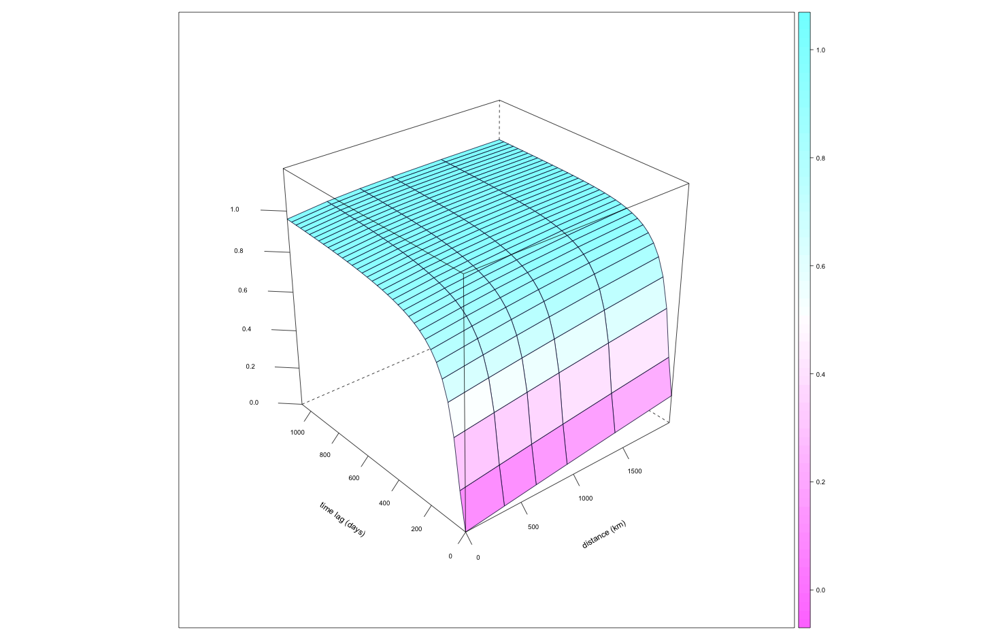

[](http://quantlet.de/index.php?p=info)

## [](http://quantlet.de/) **geocopula_par** [](http://quantlet.de/d3/ia)

```yaml

Name of QuantLet : geocopula_par

Published in : MTS

Description : Produces the plot for parametrically fitted variogram.

Keywords : graphical representation, plot, time-series, data visualization, copula

See also : geocopula_est, geocopula_emp

Author : Weining Wang

Submitted : Thur, June 30 2016 by Shi Chen

Datafile : opti.RData, vvd4t.RData

Example : The parametrically fitted variogram by GeoCopula.

```




### R Code:
```r
# clear variables and close windows
# clear variables and close windows
rm(list = ls(all = TRUE))
graphics.off()

# install and load packages
libraries = c("foreign", "gstat", "spacetime", "fossil", "tseries", "mvtnorm", 
              "xts")
lapply(libraries, function(x) if (!(x %in% installed.packages())) {
  install.packages(x)
})
lapply(libraries, library, quietly = TRUE, character.only = TRUE)

# load dataset
load("opti.RData")
load("vvd4t.RData")
nu      = 0.5
op      = order(opti$value)
opti_10 = opti[op, ][1, ]  #keep the best one, Chapter 5.2
opti_10 = opti_10[4:6]  #keep only parameters needed

# plot
layout(c(1, 2, 3, 4))
Kernel = function(h, u, nu, a, b, beta, sigma) {
  # same as in GeoCopula
  y       = rep(1, length = length(h))
  idx1    = which(h == 0)
  idx2    = which(h != 0)
  c1      = a^2 * u^2 + 1
  c2      = a^2 * u^2 + beta
  y[idx1] = sigma * beta/c1^nu/c2
  y[idx2] = sigma * 2 * beta/c1^nu/c2/gamma(nu) * (b/2 * h[idx2] * (c1/c2)^0.5)^nu * 
    besselK(b * h[idx2] * (c1/c2)^0.5, nu)
  return(y)
}
plot_v = function(data, vv, par) {
  k         = list()
  k$par     = par
  k$par[4]  = 1  #sigma=1
  data0     = vv
  gammaMod  = k$par[4] - sapply(1:nrow(data0), function(i) 
  Kernel(data0$avgDist[i], data0$timelag[i], nu, k$par[1], k$par[2], k$par[3], k$par[4]))
  vv1       = vv
  vv1$gamma = gammaMod
  plot(vv1, wireframe = T, xlab = list("distance (km)", rot = 30), ylab = list("time lag (days)", rot = -35), 
       scales = list(arrows = F, z = list(distance = 5)), 
       zlim = c(0, 1.2))
}

plot_v(d4, vvd4t, as.matrix(opti_10))

```
